# Blemish Free Detailing
A static website for a small-medium sized company specialising in car detailing. Aimed toward providing information and increasing customer bookings.\
[Link to website](https://hardingrichard.github.io/ci-ms1-blemishfreedetailing/)

## Table Of Contents

1. [Key Project Goals](#key-project-goals)
    1. [Site Owner Goals](#site-owner-goals)
    2. [User Goals](#user-goals)
2. [Information Gathering](#information-gathering)
    1. [Target Audience](#target-audience)
    2. [User Requirements](#user-requirements)
    3. [User Stories](#user-stories)
3. [Site Design](#site-design)
    1. [Wireframes](#wireframes)
    2. [Style Tile](#style-tile)
    3. [Design choice](#design-choice)
4. [Site Features](#site-features)
    1. [global](#global)
    2. [Home](#home)
    3. [About](#about)
    4. [Services](#services)
    5. [Gallery](#gallery)
    6. [Contact Us](#contact-us)
5. [Future Scope](#future-scope)
6. [Technology Stack](#technology-stack)
    1. [Languages](#languages)
    2. [Frameworks And Tools](#frameworks-and-tools)
7. [Testing](#testing)
    1. [Validation](#validation)
    2. [Performance](#performance)
    3. [Accessibility](#accessibility)
    4. [Compatibility](#compatibility)
    5. [User Stories Testing](#user-stories-testing)
8. [Bugs And Fix](#bugs-and-fixes)
9. [Deployment And Version Control](#deployment-and-version-control)
    1. [Deployment](#deployment)
    2. [Cloning](#cloning)
    3. [Version Control](#version-control)
10. [Credits](#credits)
    1. [External Code](#external-code)
    2. [Assets Used](#assets-used)
11. [Acknowledgements](#acknowledgements)

## Key Project Goals

### Site Owner Goals
* Increase brand awareness
* Provide information to customers about the business
* Increase the number of ways the customer can contact
* Increase revenue by providing a platform for customers to make bookings

### User Goals
* Find a company that can offer a car cleaning service
* Find information about the services that are on offer
* Be able to easily locate the business and get directions
* Contact the business to make a booking

## Information Gathering

### Target Audience
* Car owners
* People short on time to clean their car
* People who don't have the ability to clean their car
* Small to Medium sized car dealerships
* People wanting to get their car ready for sale
* Car collectors and enthusiasts

### User Requirements
* Intuitive site design to easily navigate
* Easily find pricing and company information
* Find out the business location
* Contact the business
* Responsive to multiple devices
* Features to work as intended
* Be accessible

### User Stories
No. | As a | I want to | so that
----|------|-----------|--------
1 | new user | find the prices | I can decide if the services are affordable.
2 | new user | find contact details | I can book my car to be cleaned.
3 | new user | see photos of past projects | I can see the level of quality of the services.
4 | new user | see where the company is located | I can see if they're local to me.
5 | new user | check the company has a social media presence | verify the company is genuine and see what else they are up to.
6 | new user | know more about the company | I can see how long they have been trading and have confidence using them.
7 | new user | easily navigate the website | I can go straight to the page i need.
8 | returning user | see what services are offered | I can decide which best suits my needs.
9 | returning user | see the contact number | I can make a booking.
10 | returning user | find directions to the company | I can drop my car off for cleaning.
11 | returning user | be able to leave a message | the company can get back to me at a later date.
12 | returning user | easily book my car | can have it cleaned.
13 | site owner | have the company location displayed | customers can easily find and get directions.
14 | site owner | detail the prices for services | customers know how much each service will cost them.
15 | site owner | have contact information displayed | customers can get in contact.
16 | site owner | have a gallery page | potential customers can see past work.
17 | site owner | information about the company | I can build customer trust in the company.
18 | site owner | have a simple and navigatable website | customers are able to easily find the information they are after.
19 | site owner | have an error page | when a customer navigates to a page that does not exist a 404 error page is presented.
20 | site owner | have a responsive website | customers can view the website across various devices.

## Site Design

### Wireframes

Home Page

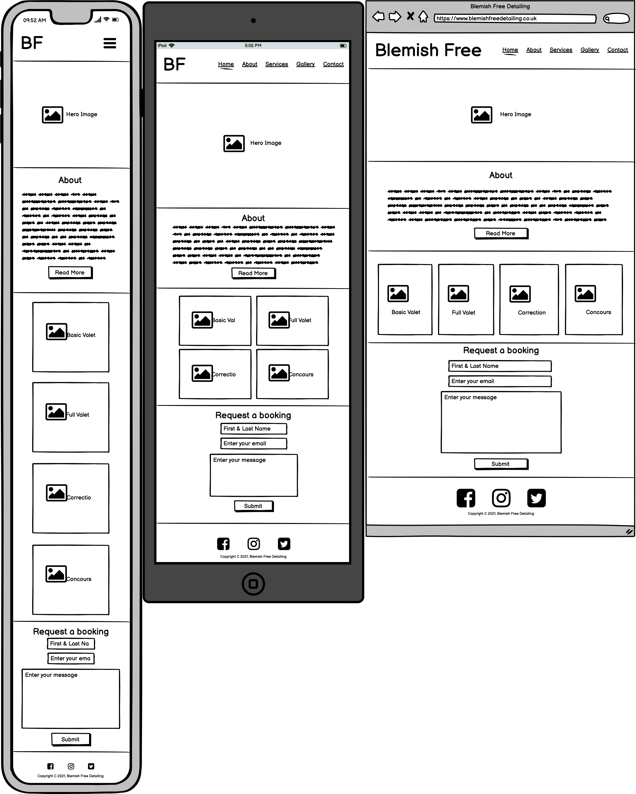

About Page

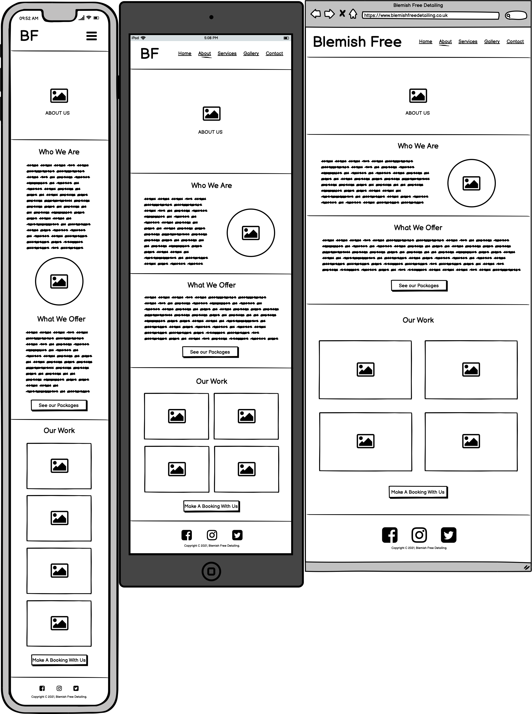

Services Page

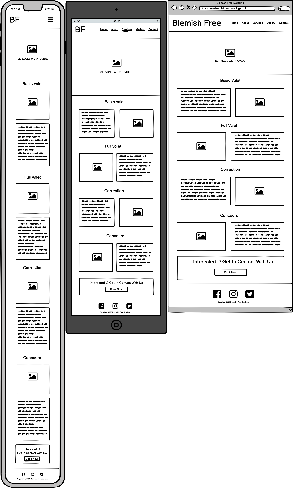

Gallery Page

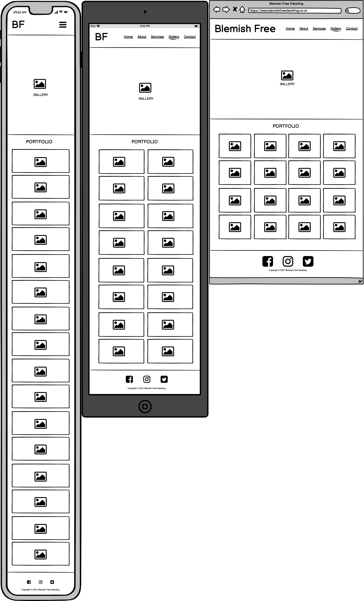

Contact Us Page

## Style Tile

Style Tile Image

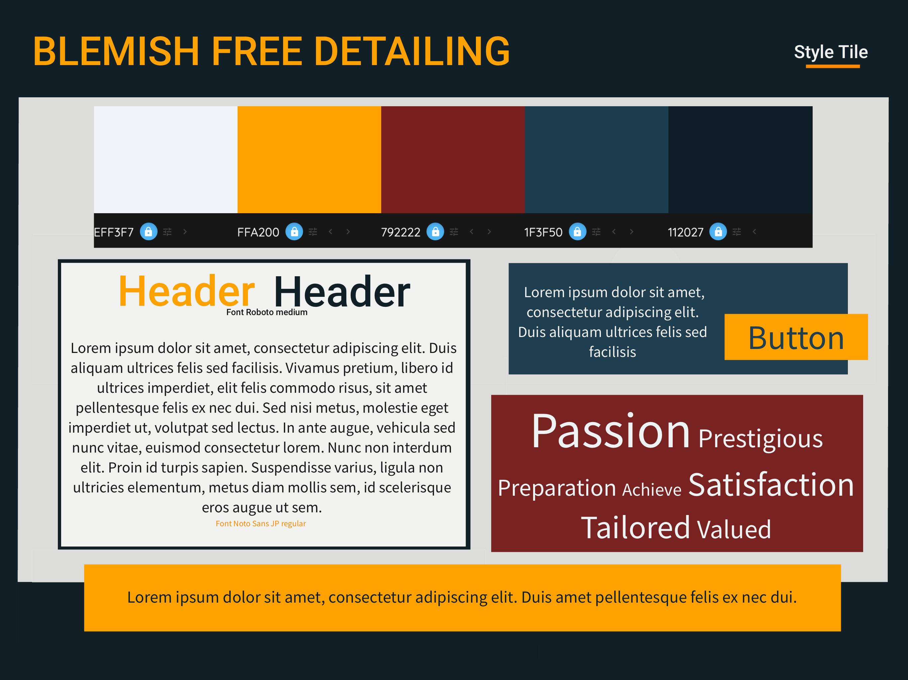

## Design choice

### Layout
The website was created in a way which is intended to be simple and convenient for the user to navigate, free from distracting
elements popping up on the screen and with links on each page in the form of buttons and image tiles which are intended to guide 
the user to the next page rather than having to scroll to the top to the navbar and navigating that way. The website consists of
five pages which include the home page, about page, services page, gallery page and contact us page.

### Fonts
Roboto medium font was used for the headers within the website along with Noto Sans for the body text.
These fonts were chosen for their easy to read and simple typography for visually impaired and dyslexic users.
The font Rubik was used for the brand name in the navbar to distinguish apart from the rest of the website text
whilst still maintaining a degree of consistency.

### Colours
The colour scheme of blues, oranges and red were used for the website, blues were used to convey trust which will increase the user confidence in navigating the website as well as having a calming affect on the user. The combination of white and blues together is also dyslexia friendly. Oranges are associated with confidence and optimism and was used for the headers against a dark background. The red was introduced for accent colours such as clickable links when hovering over and also the background for a booking box to grab the users attention after having browsed the services on offer. The colours chosen are mindful of having enough contrast ratio between one another for accessibility and visual impairment, all being tested with WebAims accessibility evaluation tool. Please refer to the [Style Tile](#style-tile) above for the mentioned colours and theming. 

## Site Features

### Global
The website consists of 5 pages all of which have 3 features which appear consistently on each page.

#### Navigation Bar
* Responsive to smaller screens with use of a hamburger menu toggler with dropdown to each page, allows user to easily click to navigate rather than having small links squeezed into a tiny area
* User Story referenced: 7, 18, 20

#### Hero Image
* Large image used to capture the users attention with 75% of the viewport to encourage scrolling
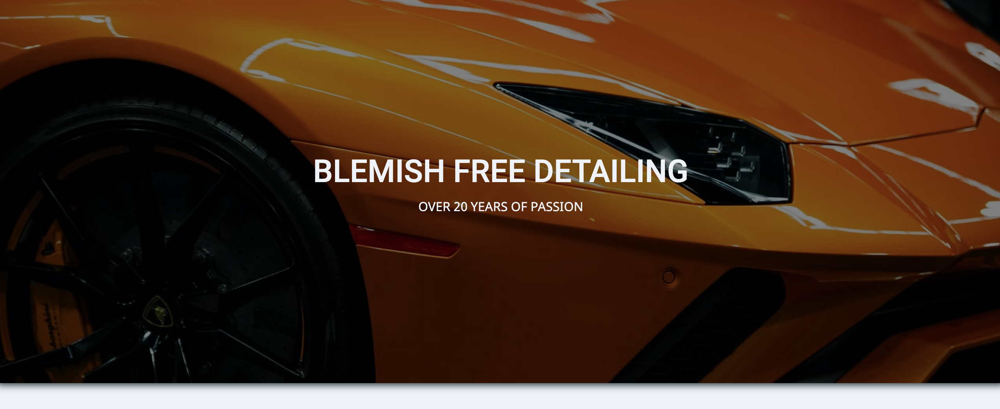

#### Footer
* Social media logos that links the user direct to social pages, accompanied with copyright message
* User Story referenced: 5

### Home
The Home page consists of 3 features: bout summary, services tiles, booking form. This page acts as a summary 
section of the website as a whole.

#### About Summary
* A brief description of the company and what they provide so the user can get an idea of the company
* Read more button that links the user to the About Us page so they can read further information
* User Story referenced: 6, 17
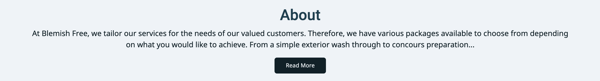

#### Services Tiles
* Image tiles with text detailing each services provided, clear for the user to see when scrolling through the page
* Clickable links to take the user to the page and section of the service tile
* User Story referenced: 7, 8, 18
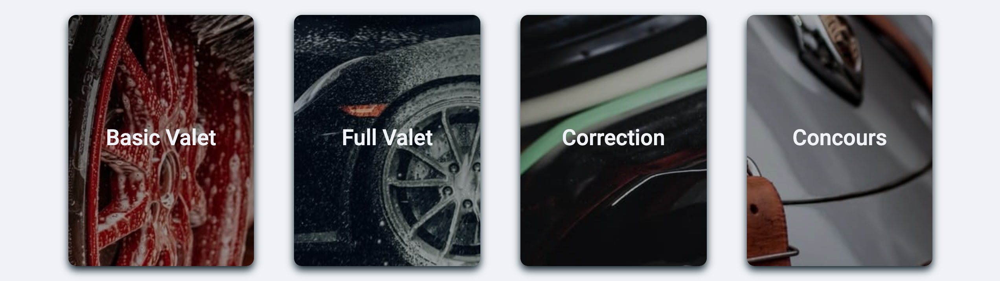

#### Booking Form
* A form where users can fill in their name, email and message to the site owner
* Required field attribute markers used so that customers do not miss required information off when submitting the form
* User Story referenced: 12
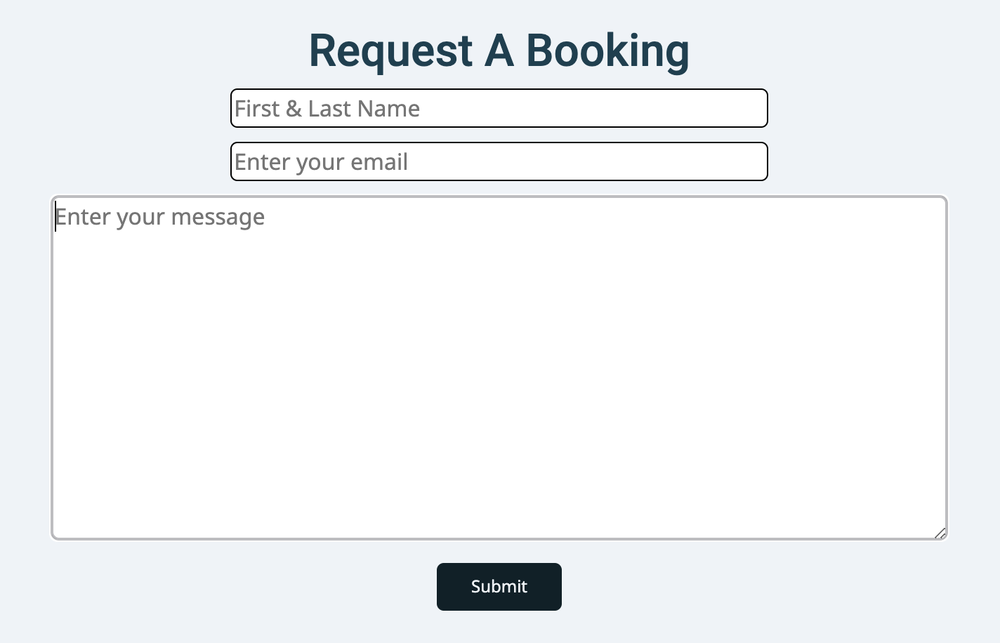

### About
The About page consists of 4 features: who we are, what we offer, our work, booking button.

#### Who We Are
* A brief bio of the company owner and his history so that users can get an idea of the background of the company
* Profile picture so that users can put a face to name
* User Story referenced: 6, 17
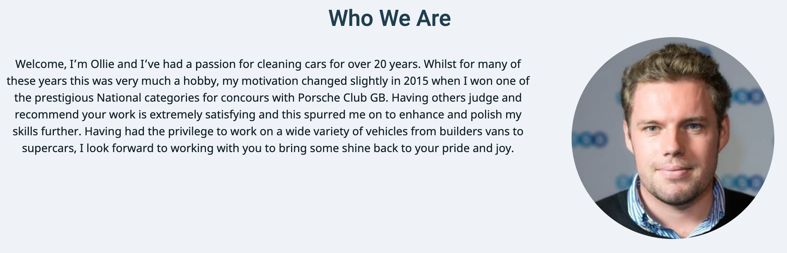

#### What We Offer
* Provides an opportunity for users to read a short description of what services the user can expect with a button to navigate directly to the services page
* User Story referenced: 7, 18
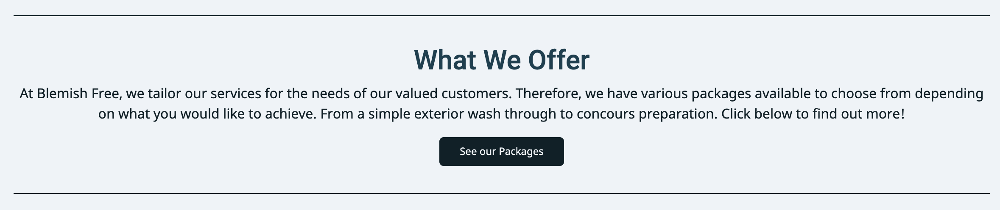

#### Our Work
* Four image examples of the work that the company has completed giving the user an expectation on the quality of work provided
* User Story referenced: 3
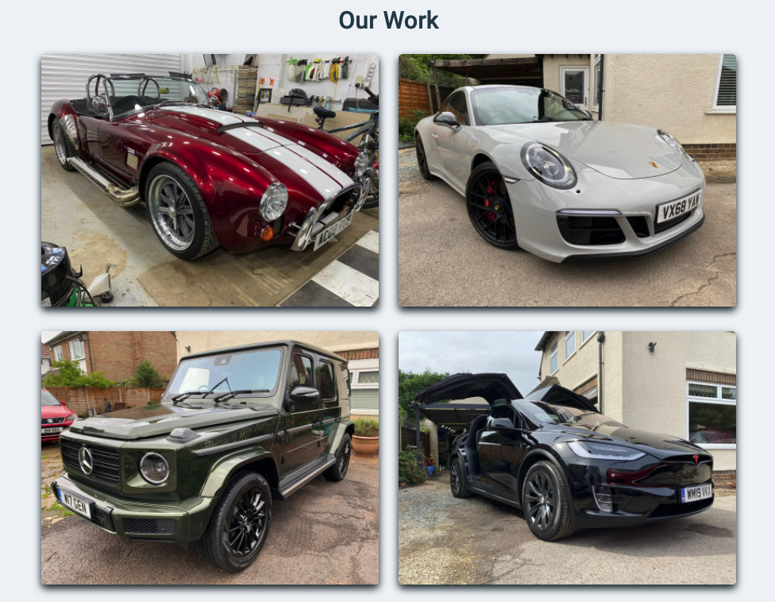

#### Booking Button
* A simple button that users can click on to be taken to the contact us page to make a booking
* User Story referenced: 7, 12, 18

### Services
The Services page consists of 2 features: services information, accent booking section with button.

#### Services Information
* Four sections; basic valet, full valet, correction and concours. Allows the user to see further information about the different services that are offered with their respective pricing for each. Images from home page used for familiarity and consistency
* User Story referenced: 1, 8, 14
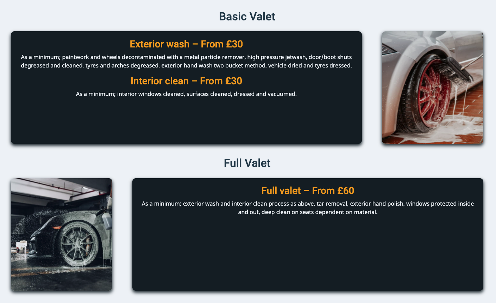

#### Accent Booking Section
* Red accent to grab the users attention to prompt them to contact and make a booking with the company
* User Story referenced: 12
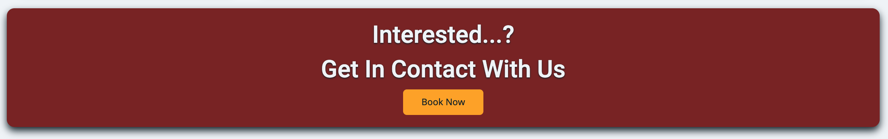

### Gallery
The Gallery page consists of 1 feature: portfolio.

#### Portfolio
* Allows the user to view a grid comprising of 4x4 images showing examples of previous work that the company has completed, so that the user can know what to expect
* User Story referenced: 3, 16

### Contact Us
The Contact Us page consists of 3 features: contact form, contact details, google map.

#### Contact Form
* A contact form which comprises of first and last name field, email field and message box. Allows the user to fill in their information in order to send a message to the site owner for bookings or enquiries
* User Story referenced: 11
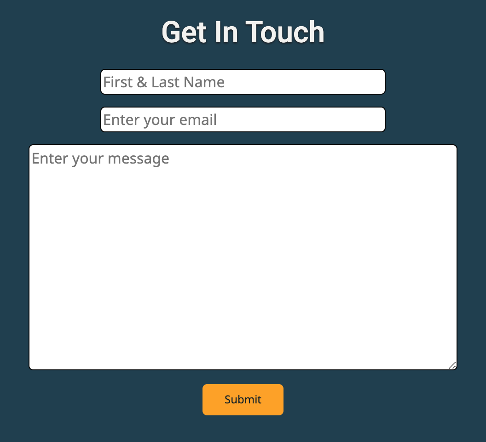

#### Contact Details
* Allows the users to view the address, email and telephone number of the company for contact
* A direction button linking the user to an external page for google directions from their current location
* Social media links directing users to the platform where the company has a social presence
* User Story referenced: 2, 4, 5, 9, 10, 13, 15
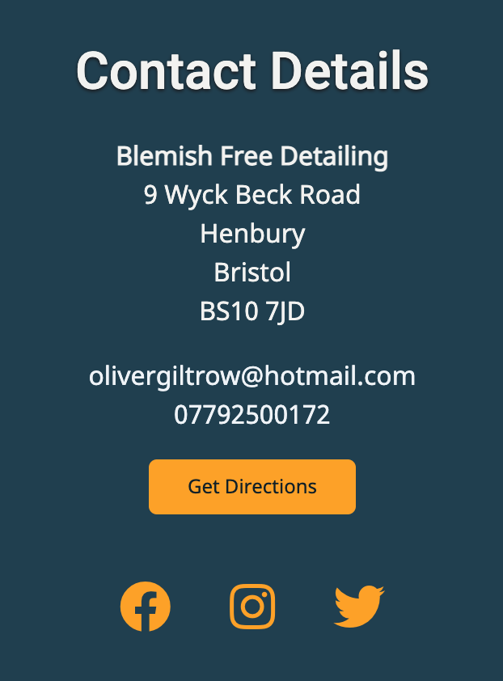

#### Google Map
* Allows the users to view the company location on an embedded google map making the company easy to find and further opportunity to get visual directions to where the company is located
* User Story referenced: 4, 10, 13
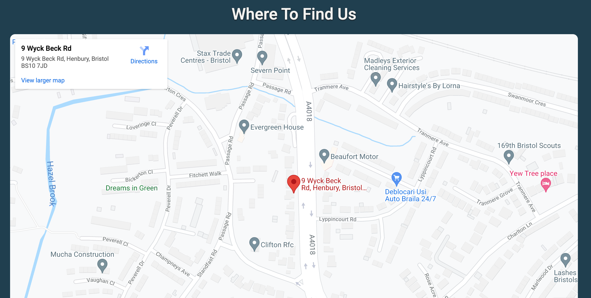

### 404 Error page
The 404 Error Page consists of 2 features: 404 error image and a Return Home button

#### 404 Error Image and Return Home button
* Allows the user to see that they have tried accessing a page that didnt exist and is presented with an error message in form of an image
* A Return Home button which allows the user to navigate back to the Home Page without having to press the back button
* User Story Referenced: 19
* 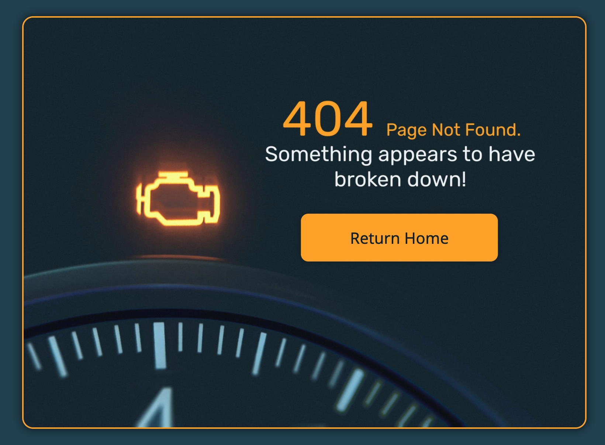

## Future Scope

### Features To Be Added
* Booking system
* JavaScript implementation for smoother user experience
* Back end database requirements for form submission and customer information

## Technology Stack

### Languages
* HTML5
* CSS3

### Frameworks And Tools
* Git
* GitPod
* GitHub
* Bootstrap v5.0
* Chrome DevTools
* Chrome Lighthouse
* Balsamiq Wireframes
* Colormind colour pallette demo
* Google Fonts
* Font Awesome
* Unsplash
* Procreate

## Testing

### Validation

#### HTML Validation
To test and validate the HTML code of the website, the W3C Markup Validation Service was used, resulting in zero errors or warnings.
See dropdowns below to view screenshots.

Home Page

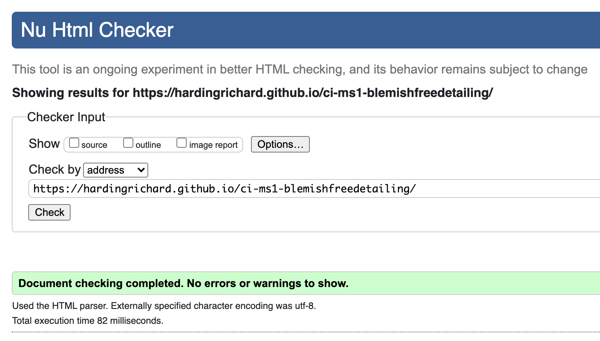

About Page

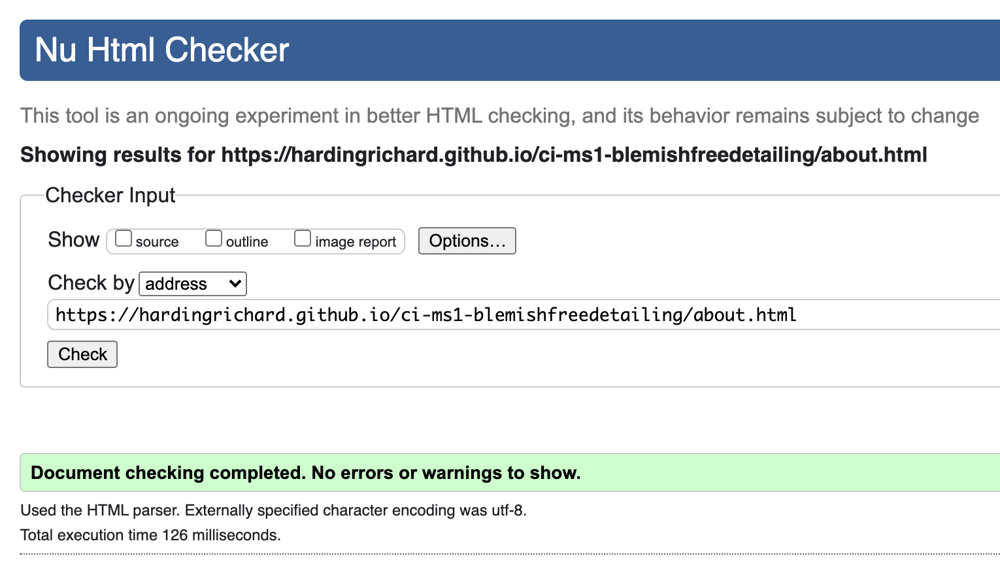

Services Page

Gallery Page

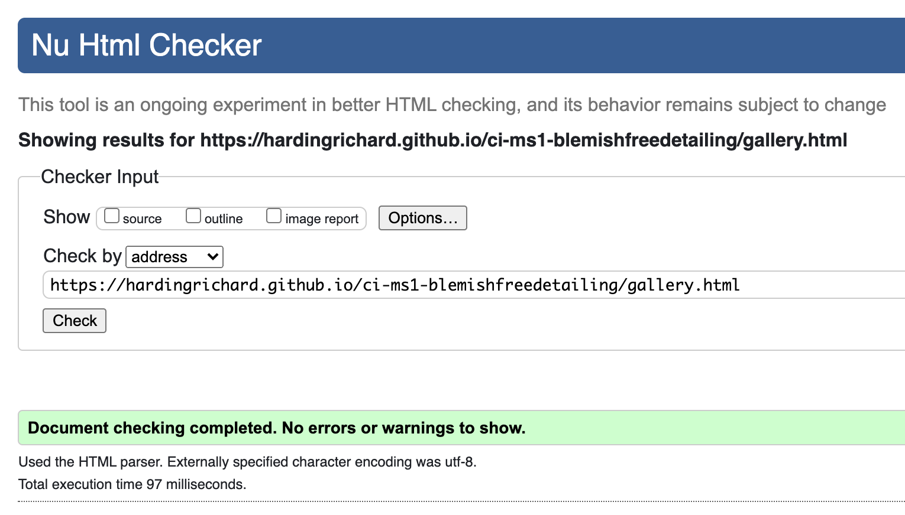

Contact Us Page

#### CSS Validation
To test and validate the CSS code of the website, the W3C CSS Validation Service was used, resulting in zero errors and zero warnings 
to own code within the style.css. However, there were warnings relating to external Bootstrap v5.0 code used within the html files for the navigation bar.

Website CSS validation

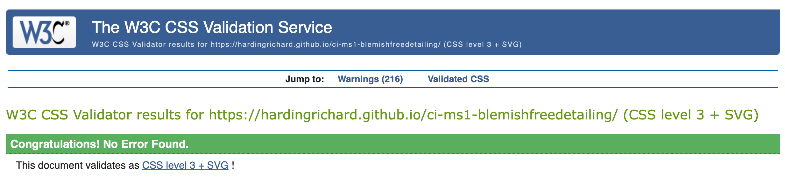

style.css validation

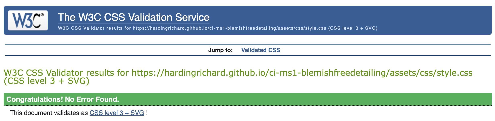

### Performance
In order to test the performance of the website, Google Lighthouse was used in the Google Chrome Developer Tools. Please see below dropdowns for screenshots

Home Page

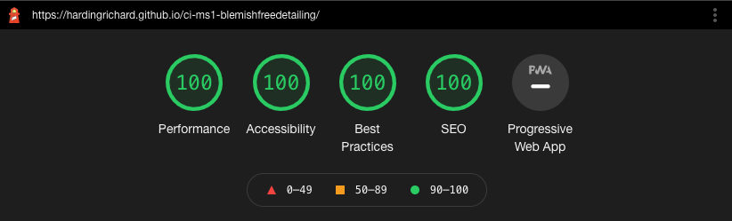

About Page

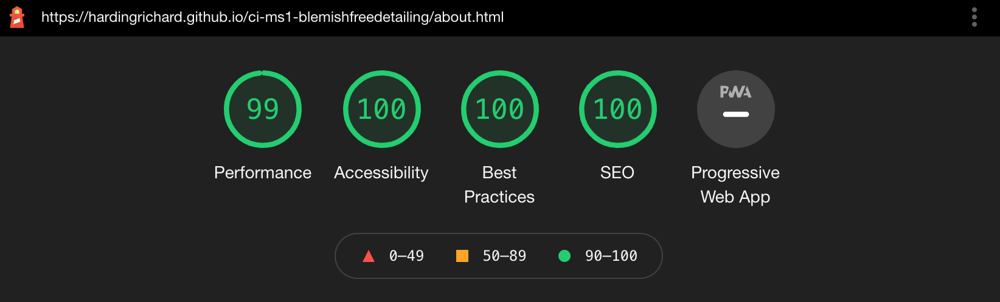

Services Page

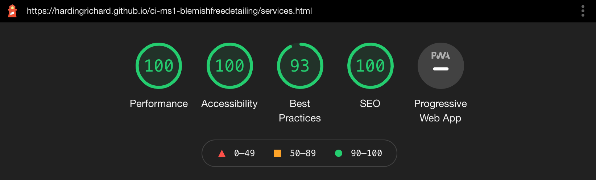

Gallery Page

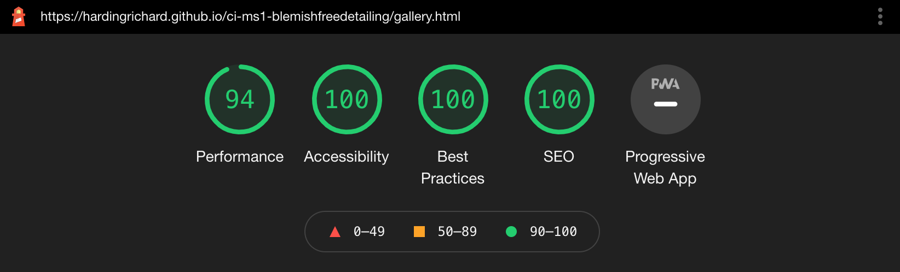

Contact Us Page

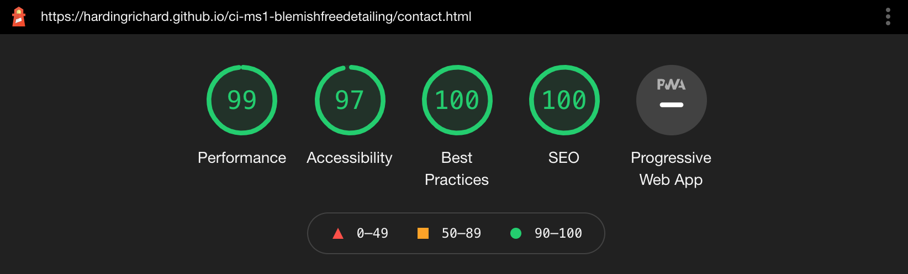

### Accessibility
To validate the accessibility of the website, the WAVE powered by WebAIM web accessibility evaluation tool was used. There were zero errors presented
which ensures that the website is of a high standard in terms of accessibility. Please see below dropdowns for screenshots.

Home Page

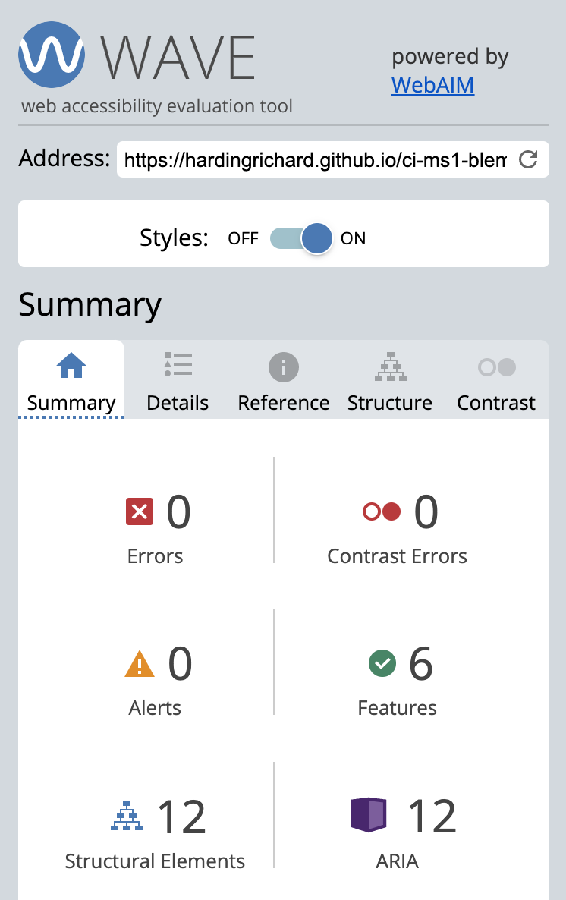

About Page

Services Page

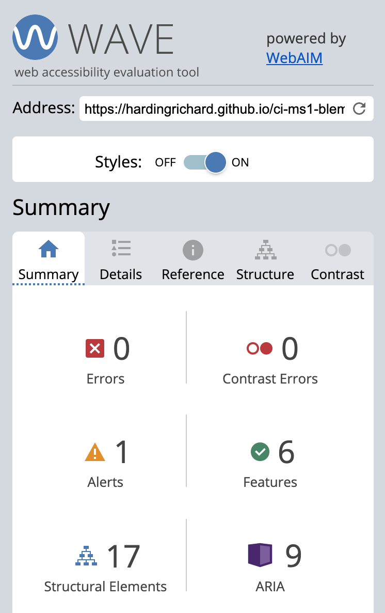

Gallery Page

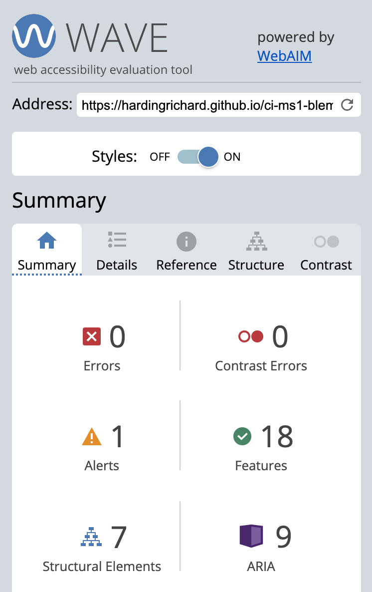

Contact Us Page

### Compatibility
The website and all it's pages were tested using Google Chrome Developer Tools using the device emulation tool. Additionaly, the website was also compatibiliy tested on the following various physical devices:
* iPhone SE 2020
* iPhone 12
* Huawei Mate 20 Pro
* Samsung Galaxy S20
* Samsung Galaxy S7 Tab
* iPad Pro  
  
The following browsers were used during the testing process:
* Google Chrome
* Apple Safari
* Microsoft Edge
* Mozilla Firefox

### User Stories Testing
Testing and screenshots of the User Stories identified towards the top of the README are as follows:

>  No. | As a | I want to | so that
>  ----|------|-----------|--------
>  1 | new user | find the prices | I can decide if the services are affordable.

Site Feature | Path of Action | Outcome | Testing Result
-------------|----------------|---------|----------------
Services | Navigate to the services page in the Navbar or clicking on the image tiles on main page | Can see the pricing for each level of service | Worked as intended

See Screenshots

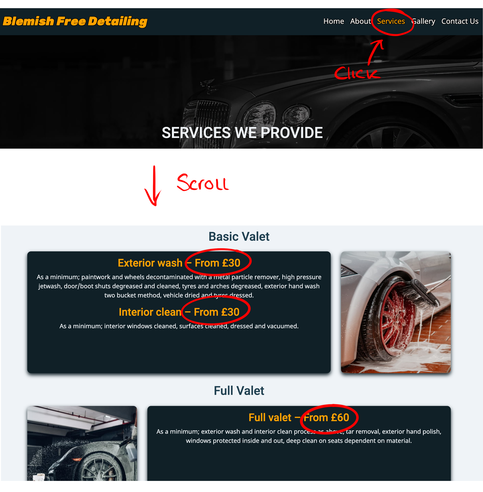

  
 

>  No. | As a | I want to | so that
>  ----|------|-----------|--------
>  2 | new user | find contact details | I can book my car to be cleaned.

Site Feature | Path of Action | Outcome | Testing Result
-------------|----------------|---------|----------------
Contact Details | Navigate to the contact us page by clicking in navbar then scrolling down to contact details section | Can see the address, email and telephone number displayed clearly | Worked as intended

See Screenshots

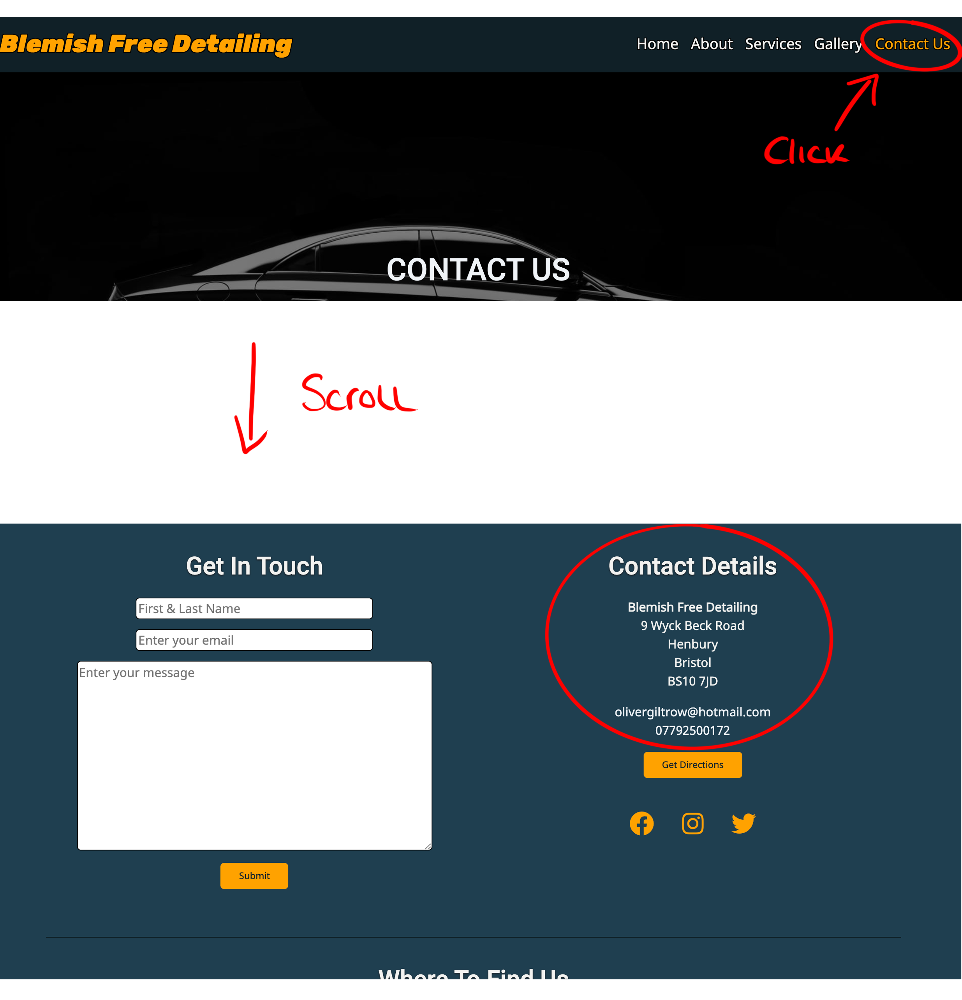

 

>  No. | As a | I want to | so that
>  ----|------|-----------|--------
>  3 | new user | see photos of past projects | I can see the level of quality of the services.

Site Feature | Path of Action | Outcome | Testing Result
-------------|----------------|---------|----------------
Our Work | Navigate to About page and scroll down to Our Work section | Can see 4 example images of cars the company has worked on | Worked as intended
Portfolio | Navigate to the Gallery page and scroll down to the Portfolio | Can see a 4x4 grid of 16 total images showing a variety of examples of cars worked on | Worked as intended

See Screenshots

 

>  No. | As a | I want to | so that
>  ----|------|-----------|--------
>  4 | new user | see where the company is located | I can see if they're local to me.

Site Feature | Path of Action | Outcome | Testing Result
-------------|----------------|---------|----------------
Get Directions button | Navigate to Contact Us page and scroll down to click on Get Directions | Clicking button directs you to google maps and directions for sat-nav purposes | Worked as intended
Google Embeded Map | Navigate to Contact Us page and scroll down to the Where To Find Us section | Can see a large and clear map with a red pin marking the company location on the map | Worked as intended 

See Screenshots

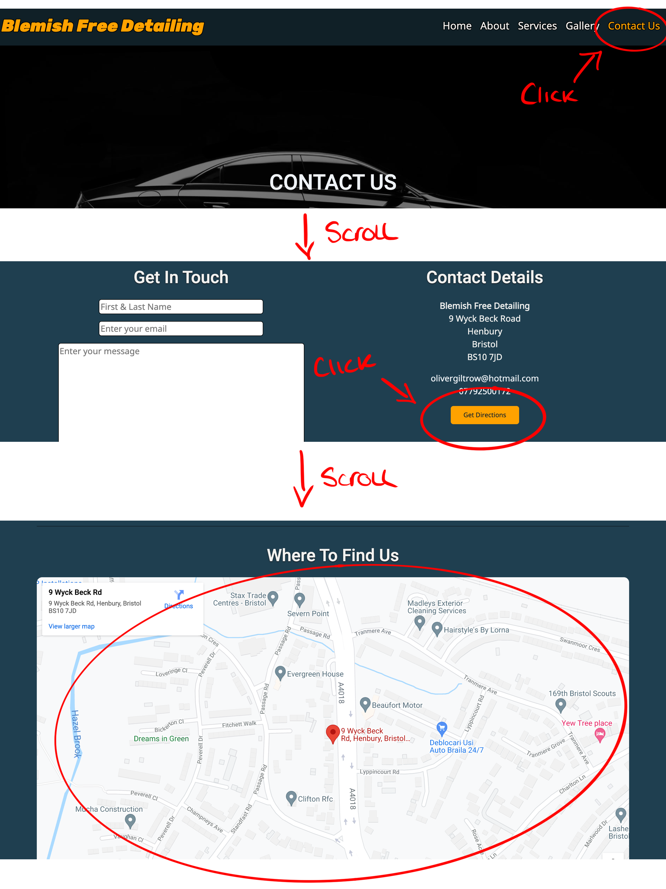

 

>  No. | As a | I want to | so that
>  ----|------|-----------|--------
>  5 | new user | check the company has a social media presence | verify the company is genuine and see what else they are up to.

Site Feature | Path of Action | Outcome | Testing Result
-------------|----------------|---------|----------------
Footer Social Media Links | Scroll down from the current page to the footer and click orange logos | Clicking the orange logos opens a new tab to the required social platform | Worked as intended but social profiles not yet set up. Pending
Contact Us Social Media Links | Navigate to Contact Us page and scroll down to Contact Details, under the contact details the social media logos are displayed | Clicking the orange logos opens a new tab to the required social platform | Worked as intended but social profiles not yet set up. Pending

See Screenshots

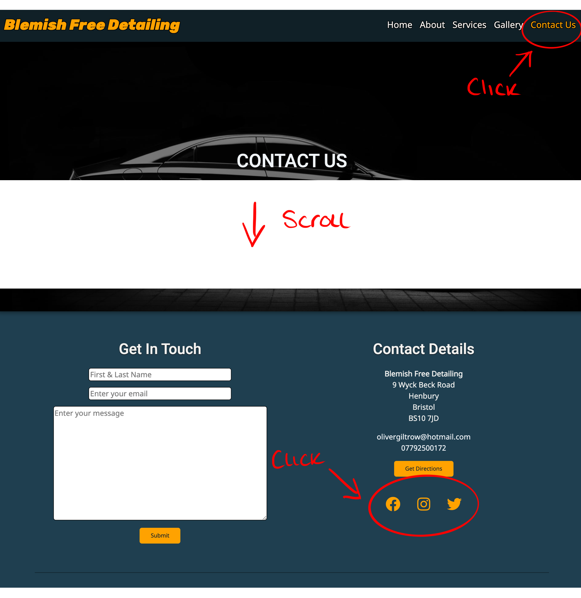

 

>  No. | As a | I want to | so that
>  ----|------|-----------|--------
>  6 | new user | know more about the company | I can see how long they have been trading and have confidence using them.

Site Feature | Path of Action | Outcome | Testing Result
-------------|----------------|---------|----------------
Who We Are | Navigate to About page and scroll down to Who We Are sections | Can see a paragraph about the owner of the company, easy to read giving information about the history and a profile picture of the owner giving a personable experience | Worked as intended

See Screenshots

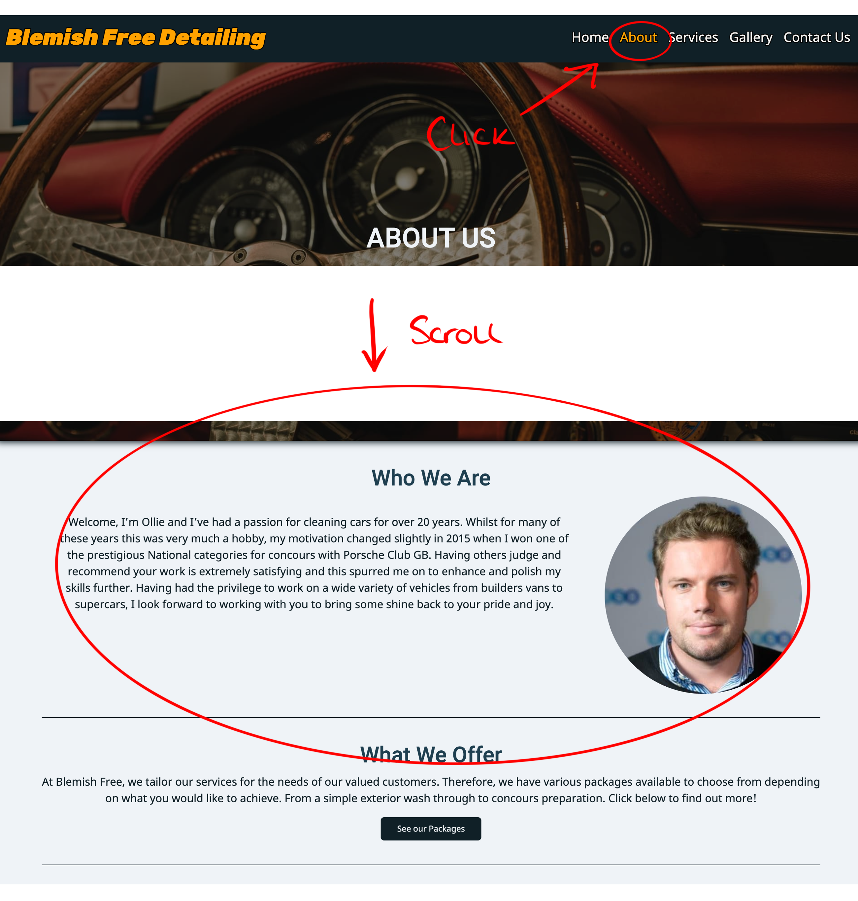

 

>  No. | As a | I want to | so that
>  ----|------|-----------|--------
>  7 | new user | easily navigate the website | I can go straight to the page i need.

Site Feature | Path of Action | Outcome | Testing Result
-------------|----------------|---------|----------------
Navbar | Use navigation bar at top to go to desired page | Clicking on one of the navigation links directs to the relevant page. Clicking the brand name quick directs back to the homepage | Worked as intended
Image tiles and buttons | Scroll down from home page to read more button or scroll further to services image tiles | Clicking on the read more button navigates to the About Us page for further information about the company. Clicking on each Service image tile navigates directly to the coresponding service type on the Services page, making it easy and efficient to get to the required information | Worked as intended

See Screenshots

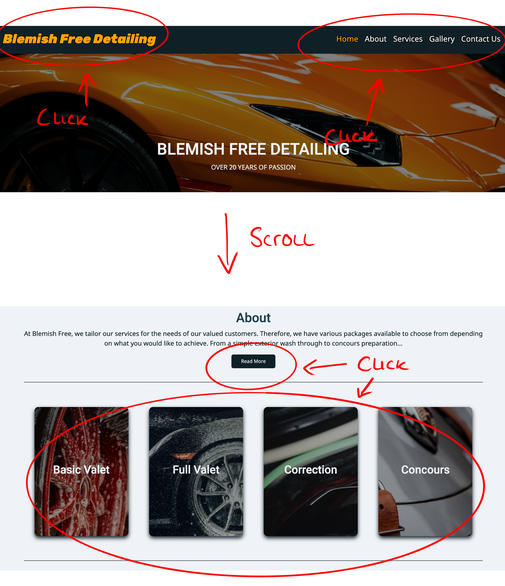

 

>  No. | As a | I want to | so that
>  ----|------|-----------|--------
>  8 | returning user | see what services are offered | I can decide which best suits my needs.

Site Feature | Path of Action | Outcome | Testing Result
-------------|----------------|---------|----------------
Service image tiles | Scroll down from top of home page past the About section to the images section | 4 images displayed with overlayed text with the titles of what each image is in relation to. Clicking the image or text navigates directly to the corresponding service type | Worked as intended
Services We Provide | Navigate to services page and scroll down past hero image to Basic Valet, Full Valet, Correction and Concours | Each service type is sectioned in its own box making it easy to read and distinguish between the service types and what each includes | Worked as intended

See Screenshots

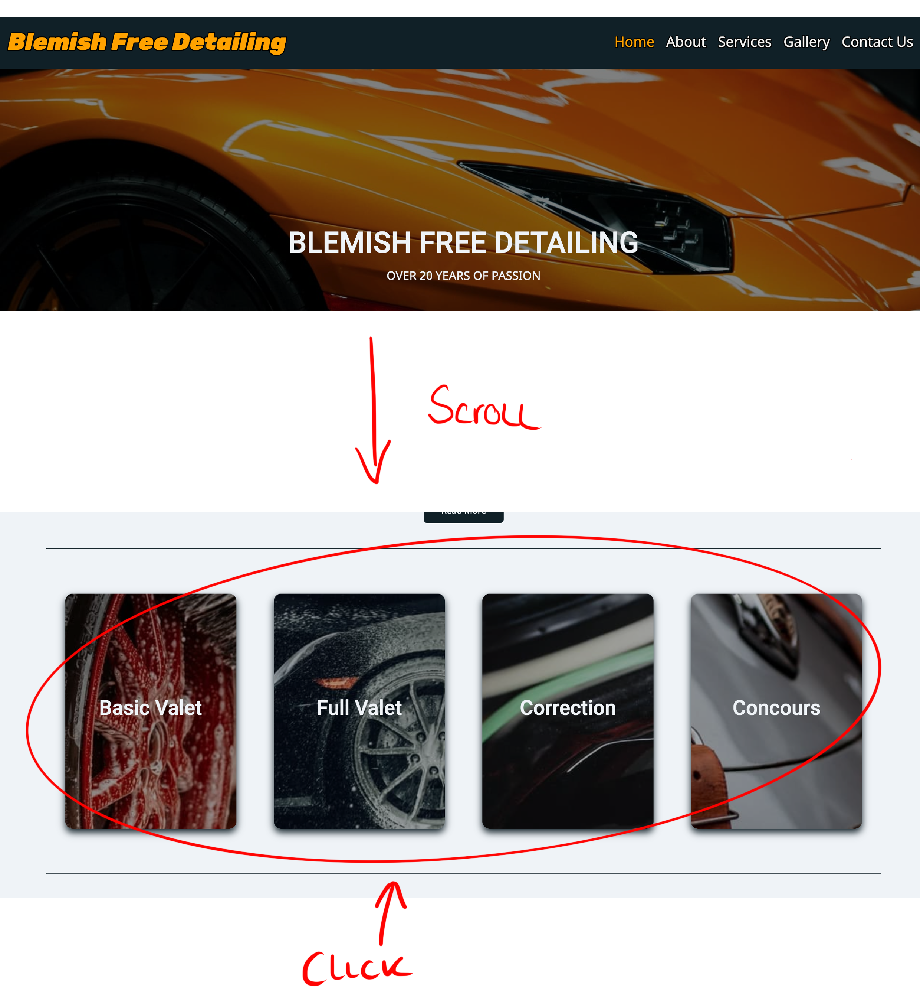
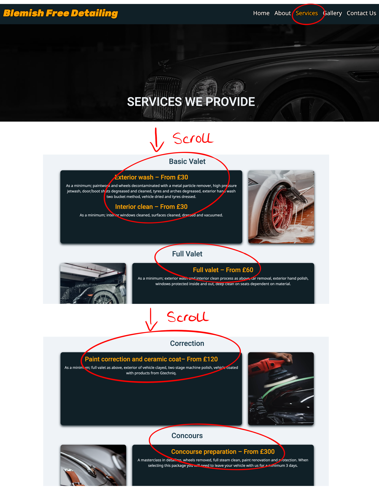

 

>  No. | As a | I want to | so that
>  ----|------|-----------|--------
>  9 | returning user | see the contact number | I can make a booking.

Site Feature | Path of Action | Outcome | Testing Result
-------------|----------------|---------|----------------
Contact details | Navigate to Contact Us page via navbar, scroll down to contact details section | Easy to find with the contact number displayed under the email address in a logical position and is clickable to bring up the call app on the users device so that they don't have to manually enter the number | Worked as intended

See Screenshots

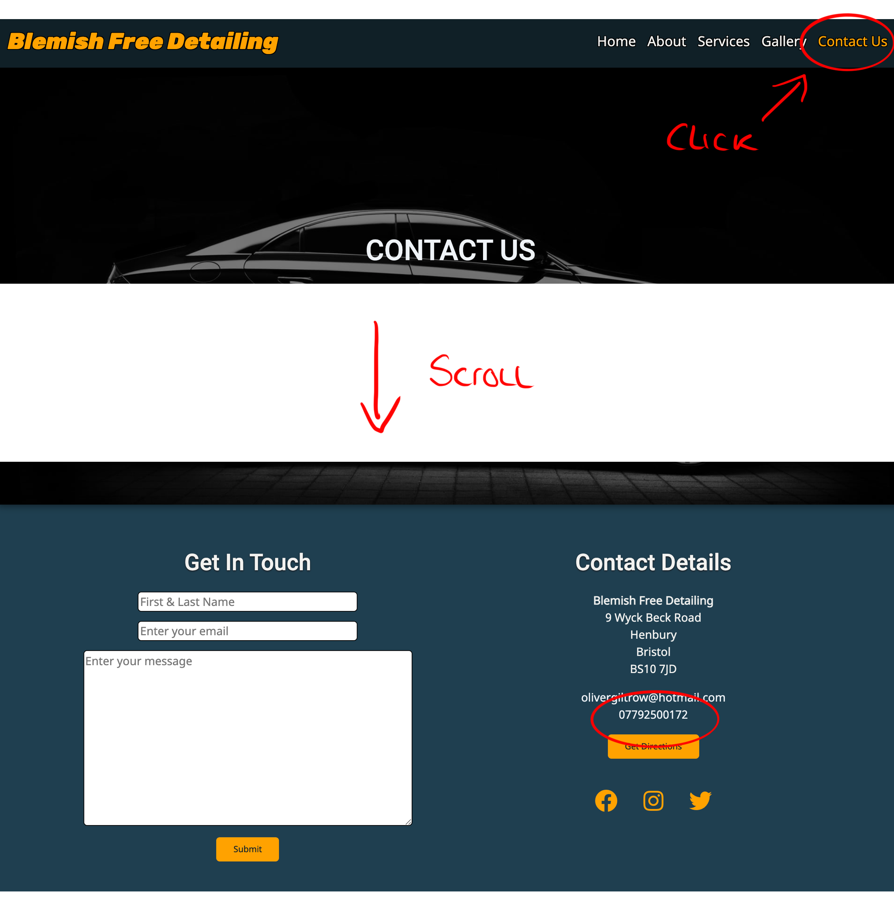

 

>  No. | As a | I want to | so that
>  ----|------|-----------|--------
>  10 | returning user | find directions to the company | I can drop my car off for cleaning.

Site Feature | Path of Action | Outcome | Testing Result
-------------|----------------|---------|----------------
Get Directions button | Navigate to Contact Us page and scroll down to click on Get Directions | Clicking button directs you to google maps and directions for sat-nav purposes | Worked as intended
Google Embeded Map | Navigate to Contact Us page and scroll down to the Where To Find Us section | Can see a large and clear map with a red pin marking the company location on the map | Worked as intended 

See Screenshots

 

>  No. | As a | I want to | so that
>  ----|------|-----------|--------
>  11 | returning user | be able to leave a message | they can get back to me at a later date.

Site Feature | Path of Action | Outcome | Testing Result
-------------|----------------|---------|----------------
Request A Booking | Scroll down from home page to the bottom of the page to the Request A Booking section | Conveniently located on the homepage simple interface requiring first and last name, email address and an opportunity to type a message. Clicking the submit button sends the form | Worked as intended
Get In Touch | Navigate to the Contact Us page and scroll down to the Get In Touch section | Simple form requiring first and last name, email ddress and an opportunity to type message with resizable box, clicking the submit button sends the form | Worked as intended
Contact Details | Navigate to the Contact Us page and scroll down to the Contact Details section | Email address clearly displayed, clicking brings up the email app to be able to send an email from personal email address. Telephone number is clearly displayed under email address, clicking brings up the call app on device to be able to call the site owner without having to manually enter the numbers avoiding type in errors | Worked as intended

See Screenshots

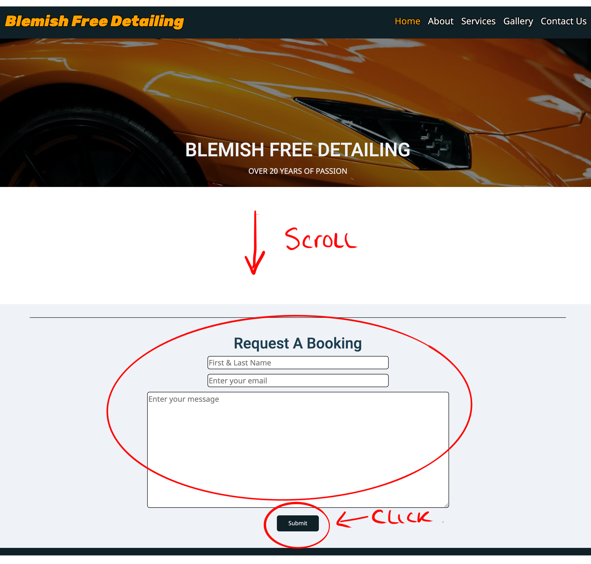
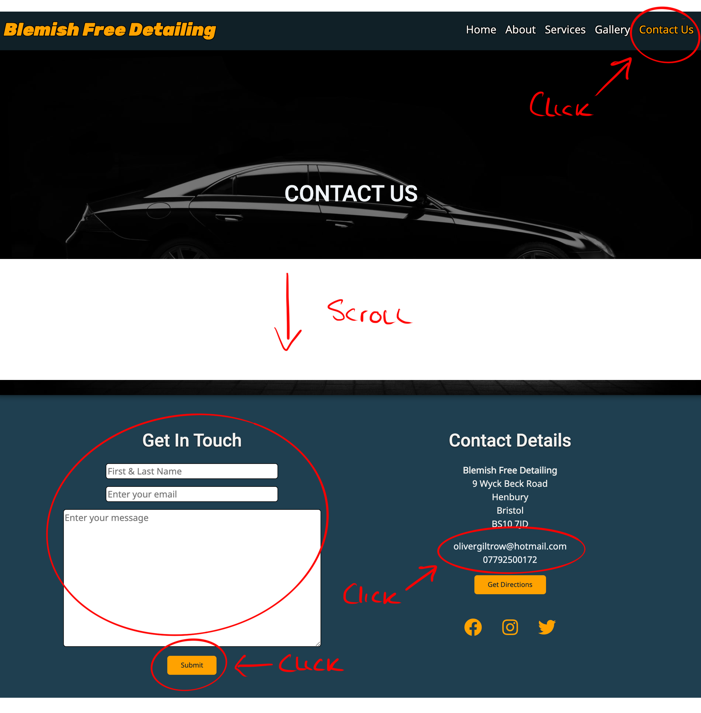

 

>  No. | As a | I want to | so that
>  ----|------|-----------|--------
>  12 | returning user | easily book my car | can have it cleaned.

Site Feature | Path of Action | Outcome | Testing Result
-------------|----------------|---------|----------------
Request A Booking | Scroll down from home page to the bottom of the page to the Request A Booking section | Conveniently located on the homepage simple interface requiring first and last name, email address and an opportunity to type a message. Clicking the submit button sends the form | Worked as intended
Get In Touch | Navigate to the Contact Us page and scroll down to the Get In Touch section | Simple form requiring first and last name, email ddress and an opportunity to type message with resizable box, clicking the submit button sends the form | Worked as intended
Contact Details | Navigate to the Contact Us page and scroll down to the Contact Details section | Email address clearly displayed, clicking brings up the email app to be able to send an email from personal email address. Telephone number is clearly displayed under email address, clicking brings up the call app on device to be able to call the site owner without having to manually enter the numbers avoiding type in errors | Worked as intended

See Screenshots

 

>  No. | As a | I want to | so that
>  ----|------|-----------|--------
>  13 | site owner | have the company location displayed | customers can easily find and get directions.

Site Feature | Path of Action | Outcome | Testing Result
-------------|----------------|---------|----------------
Get Directions button | Navigate to Contact Us page and scroll down to click on Get Directions | Clicking button directs you to google maps and directions for sat-nav purposes | Worked as intended
Google Embeded Map | Navigate to Contact Us page and scroll down to the Where To Find Us section | Can see a large and clear map with a red pin marking the company location on the map | Worked as intended 

See Screenshots

 

>  No. | As a | I want to | so that
>  ----|------|-----------|--------
>  14 | site owner | detail the prices for services | customers know how much each service will cost them.

Site Feature | Path of Action | Outcome | Testing Result
-------------|----------------|---------|----------------
Services | Navigate to the services page in the Navbar or clicking on the image tiles on main page | Can see the price starting from for each level of service clearly displayed | Worked as intended

See Screenshots

  
 

>  No. | As a | I want to | so that
>  ----|------|-----------|--------
>  15 | site owner | have contact information displayed | customers can get in contact.

Site Feature | Path of Action | Outcome | Testing Result
-------------|----------------|---------|----------------
Contact Details | Navigate to the contact us page by clicking in navbar then scrolling down to contact details section | Can see the address, email and telephone number displayed clearly | Worked as intended

See Screenshots

 

>  No. | As a | I want to | so that
>  ----|------|-----------|--------
>  16 | site owner | have a gallery page | potential customers can see past work.

Site Feature | Path of Action | Outcome | Testing Result
-------------|----------------|---------|----------------
Portfolio | Navigate to the Gallery page and scroll down to view gallery of images | Can see a 4x4 grid of 16 total images showing a variety of examples of cars worked on | Worked as intended

See Screenshots

 

>  No. | As a | I want to | so that
>  ----|------|-----------|--------
>  17 | site owner | information about the company | I can build customer trust in the company.

Site Feature | Path of Action | Outcome | Testing Result
-------------|----------------|---------|----------------
Who We Are | Navigate to About page and scroll down to Who We Are sections | Can see a paragraph about the owner of the company, easy to read information about the history and a profile picture of the owner giving a personable experience being able to see who is behind the company | Worked as intended

See Screenshots

 

>  No. | As a | I want to | so that
>  ----|------|-----------|--------
>  18 | site owner | have a simple and navigatable website | customers are able to easily find the information they are after.

Site Feature | Path of Action | Outcome | Testing Result
-------------|----------------|---------|----------------
Navbar | Use navigation bar at top to go to desired page | Clicking on one of the navigation links directs to the relevant page. Clicking the brand name quick directs back to the homepage | Worked as intended
Image tiles and buttons | Scroll down from home page to read more button or scroll further to services image tiles | Clicking on the read more button navigates to the About Us page for further information about the company. Clicking on each Service image tile navigates directly to the coresponding service type on the Services page, making it easy and efficient to get to the required information | Worked as intended

See Screenshots

 

>  No. | As a | I want to | so that
>  ----|------|-----------|--------
>  19 | site owner | have an error page | when a customer navigates to a page that does not exist a 404 error page is presented.

Site Feature | Path of Action | Outcome | Testing Result
-------------|----------------|---------|----------------
404 Error image | Produce a page error by adding an extra l on the end of /index.html | A 404 error page is loaded and displayed with the message "404 Page Not Found. Something appears to have broken down! | Worked as intended
Return Home Button | Produce a page error by adding an extra l on the end of /index.html | A 404 error page is loaded and displayed, under the error message in the image is a navigation button, when clicked directs the user back to the Home page of the website | Worked as intended

See Screenshots

 

>  No. | As a | I want to | so that
>  ----|------|-----------|--------
>  20 | site owner | have a responsive website | customers can view the website across various devices.

Site Feature | Path of Action | Outcome | Testing Result
-------------|----------------|---------|----------------
Navbar | Open website on mobile device to view a hamburger menu icon in the top right corner in place of navigation links | Clicking on the hamburger icon in the top right corner collapses the navigation menu allowing the user to easily see and click on the website pages. Clicking on one of the links navigates to desired page on smaller screens | Worked as intended
Images | Open website across the following devices: Mobile, Tablet, Desktop. Scroll down from Home page to images of Service Image tiles | Opening the Home page on mobile, the user is presented with a column of 4 images stacked ontop of one another. Opening the Home page on tablet the user is presented with a grid of 2x2 images. Opening the Home page on desktop the user is presented with a row of 4 images | Worked as intended

See Screenshots

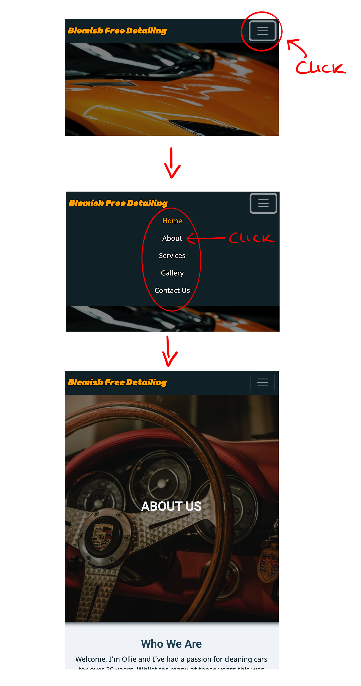

## Bugs And Fix
Known Bugs | Fix
-----------|-----
Unable to get the navbar toggler to collapse on small screens | Hadn't included the cached JavaScript link to get script to run for intended behaviour
Body font would not update with Noto Sans due to Bootstrap styling overriding | CSS style sheet link positioned below the bootstrap style link to override bootstrap styling
Navbar CSS styling wasn't carrying over to the other pages of the website | Updated the code across pages with an amended class for the nav
Hero image overlay text is appearing at the bottom margin on small screen devices but is appearing fine in Google Dev Tools | Removed margins and object-position to center.

## Deployment And Version Control

### Deployment
GitHub Pages was used in order to deploy the live version of the website. This was done by completing the following:
1. Locate and click on the Settings tab within the repository
2. From here on the left hand side go down and click Pages
3. The GitHub Pages page will be displayed, locate the Source and set the branch to main
4. If this has been completed successfully then a message will be displayed at the top with a green check "Your site is published at https://hardingrichard.github.io/ci-ms1-blemishfreedetailing/"  
  
[Click Here](https://docs.github.com/en/pages/getting-started-with-github-pages/configuring-a-publishing-source-for-your-github-pages-site) for further guidance and instructions on how to deploy yours.

### Cloning
If you wish to clone the repository you can do so by [clicking here](https://docs.github.com/en/repositories/creating-and-managing-repositories/cloning-a-repository) or completing the following:
1. Locate and click on the Code button at the top of the directory within the GitHub repository
2. This will dropdown the option of HTTPS, SSH and GitHub CLI and the option to open with GitHub Desktop or Download ZIP. Choose the option you prefer and click the copy to clipboard button
3. Open the Git bash terminal
4. Choose the working directory location to where you wish to have the cloned directory.
5. Type "git clone" followed by pasting the URL you copied in step 2.
6. Press Enter to complete and create your local clone.

### Version Control
[Click here](https://github.com/hardingrichard/ci-ms1-blemishfreedetailing/commits/main) to explore the history of the creation process and see what the website looked at different points in time and what changes were made. Regular commits were made in order to make it easier to view the thought process during the creation of the website and readme and also have saved back up points to avoid loss of work in case of any serious malfunctions.

## Credits

### External Code
* HTML code copied from the Bootstrap v5.0 documentation snippet for the Navbar and was amended as required to be suitable to the website theme https://getbootstrap.com/docs/5.0/components/navbar
* CSS code taken and inspired from the W3 Schools tutorial on how to create a responsive image grid https://www.w3schools.com/howto/howto_css_image_grid_responsive.asp

### Assets Used
The following external images were used for the Hero Images at the top of each page as well as the services image tiles:
* [Home page hero image](assets/img/hero-image.jpg) - Photo by [Yuriy Bogdanov](https://unsplash.com/@profepix?utm_source=unsplash&utm_medium=referral&utm_content=creditCopyText) on [Unsplash](https://unsplash.com/collections/kUcCMU2Gvyc/website/8d782ec0fef6b663aedb36a3054c8fbd?utm_source=unsplash&utm_medium=referral&utm_content=creditCopyText)
* [About page hero image](assets/img/about-hero.jpg) - Photo by [Erik Olsen](https://unsplash.com/@eriksolsen?utm_source=unsplash&utm_medium=referral&utm_content=creditCopyText) on [Unsplash](https://unsplash.com/collections/kUcCMU2Gvyc/website/8d782ec0fef6b663aedb36a3054c8fbd?utm_source=unsplash&utm_medium=referral&utm_content=creditCopyText)
* [Services page hero image](assets/img/services-hero.jpg) - Photo by [Victor Furtuna](https://unsplash.com/@vicfurtuna?utm_source=unsplash&utm_medium=referral&utm_content=creditCopyText) on [Unsplash](https://unsplash.com/?utm_source=unsplash&utm_medium=referral&utm_content=creditCopyText)
* [Gallery page hero image](assets/img/gallery-hero.jpg) - Photo by [Kahl Orr](https://unsplash.com/@kahlorr?utm_source=unsplash&utm_medium=referral&utm_content=creditCopyText) on [Unsplash](https://unsplash.com/?utm_source=unsplash&utm_medium=referral&utm_content=creditCopyText)
* [Contact Us page hero image](assets/img/contact-hero.jpg) - Photo by [Samuele Errico Piccarini](https://unsplash.com/@samuele_piccarini?utm_source=unsplash&utm_medium=referral&utm_content=creditCopyText) on [Unsplash](https://unsplash.com/?utm_source=unsplash&utm_medium=referral&utm_content=creditCopyText)
* [Basic Valet image](assets/img/basic-valet.jpg) - Photo by [Adrian Dascal](https://unsplash.com/@dascal?utm_source=unsplash&utm_medium=referral&utm_content=creditCopyText) on [Unsplash](https://unsplash.com/collections/kUcCMU2Gvyc/website/8d782ec0fef6b663aedb36a3054c8fbd?utm_source=unsplash&utm_medium=referral&utm_content=creditCopyText)
* [Full Valet image](assets/img/full-valet.jpg) - Photo by [Andre Tan](https://unsplash.com/@andredantan19?utm_source=unsplash&utm_medium=referral&utm_content=creditCopyText) on [Unsplash](https://unsplash.com/?utm_source=unsplash&utm_medium=referral&utm_content=creditCopyText)
* [Correction image](assets/img/paint-correction.jpg) - Photo by [Neelabh Raj](https://unsplash.com/@neelabh_raj?utm_source=unsplash&utm_medium=referral&utm_content=creditCopyText) on [Unsplash](https://unsplash.com/?utm_source=unsplash&utm_medium=referral&utm_content=creditCopyText)
* [Concours image](assets/img/concours.jpg) - Photo by [Valdemaras Januška](https://unsplash.com/@valdemaras?utm_source=unsplash&utm_medium=referral&utm_content=creditCopyText) on [Unsplash](https://unsplash.com/?utm_source=unsplash&utm_medium=referral&utm_content=creditCopyText)

## Acknowledgements
I would like to take a moment to give my thanks:
* My sincerest gratitude to Karen who has given me endless encouragement and support throughout
* My parents and friends for testing the site as first time users to see if they found it intuitive
* Ollie whos business I have had the privilege of designing and creating the website for
* My mentor Mo Shami for his time, guidance and feedback during our meetings
* The support received by my cohort at Code Institute on slack, at times I was feeling frustrated and disheartened
