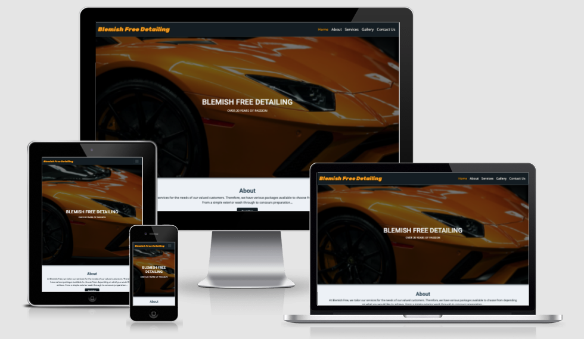
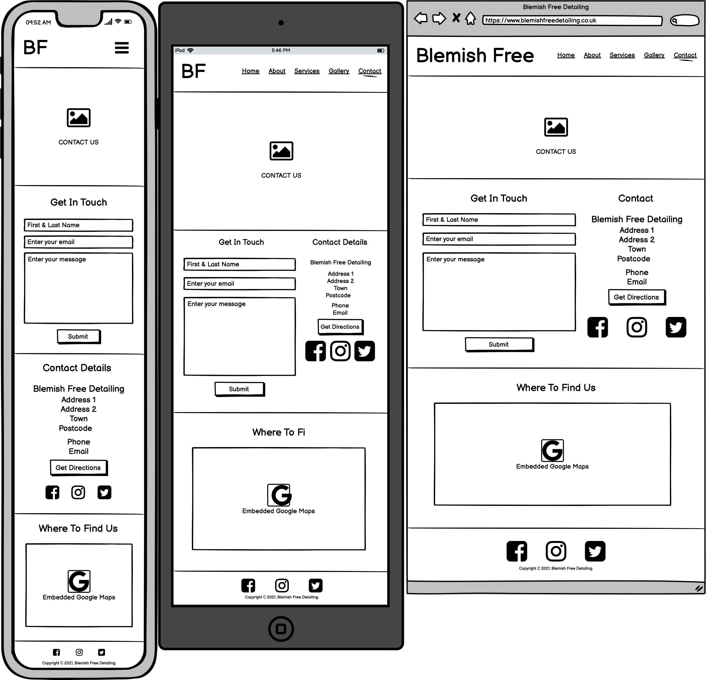
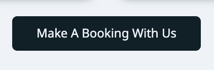

# Blemish Free Detailing
A static website for a small-medium sized company specialising in car detailing. Aimed toward providing information and increasing customer bookings.\
[Link to website](https://hardingrichard.github.io/ci-ms1-blemishfreedetailing/)

## Table Of Contents

1. [Information Gathering](#information-gathering)
    1. [Target Audience](#target-audience)
    2. [User Requirements](#user-requirements)
    3. [User Stories](#user-stories)
2. [Site Design](#site-design)
    1. [Wireframes](#wireframes)
    2. [Style Tile](#style-tile)
    3. [Design choice](#design-choice)
3. [Site Features](#site-features)
    1. [global](#global)
    2. [Home](#home)
    3. [About](#about)
    4. [Services](#services)
    5. [Gallery](#gallery)
    6. [Contact Us](#contact-us)
4. [Future Scope](#future-scope)
5. [Technology Stack](#technology-stack)
    1. [Languages](#languages)
    2. [Frameworks And Tools](#frameworks-and-tools)
6. [Testing](#testing)
    1. [Validation](#validation)
    2. [Performance](#performance)
    3. [Accessibility](#accessibility)
    4. [Compatibility](#compatibility)
    5. [User Stories Testing](#user-stories-testing)
7. [Bugs And Fix](#bugs-and-fixes)
8. [Credits](#credits)
    1. [External Code](#external-code)
    2. [Assets Used](#assets-used)
9. [Acknowledgements](#acknowledgements)

## Information Gathering

### Target Audience
* Car owners
* People short on time to clean their car
* People who don't have the ability to clean their car
* Small to Medium sized car dealerships
* People wanting to get their car ready for sale
* Car collectors and enthusiasts

### User Requirements
* Intuitive site design to easily navigate
* Easily find pricing and company information
* Find out the business location
* Contact the business
* Responsive to multiple devices
* Features to work as intended
* Be accessible

### User Stories
No. | As a | I want to | so that
--|-----|-----------|--------
1 | new user | find the prices | I can decide if the services are affordable.
2 | new user | find contact details | I can book my car to be cleaned.
3 | new user | see photos of past projects | I can see the level of quality of the services.
4 | new user | see where the company is located | I can see if they're local to me.
5 | new user | check the company has a social media presence | verify the company is genuine and see what else they are up to.
6 | new user | know more about the company | I can see how long they have been trading and have confidence using them.
7 | new user | easily navigate the website | I can go straight to the page i need.
8 | returning user | see what services are offered | I can decide which best suits my needs.
9 | returning user | see the contact number | I can make a booking.
10 | returning user | find directions to the company | I can drop my car off for cleaning.
11 | returning user | be able to leave a message | they can get back to me at a later date.
12 | returning user | easily book my car | can have it cleaned.
13 | site owner | have the company location displayed | customers can easily find and get directions.
14 | site owner | detail the prices for services | customers know how much each service will cost them.
15 | site owner | have contact information displayed | customers can get in contact.
16 | site owner | have a gallery page | potential customers can see past work.
17 | site owner | information about the company | I can build customer trust in the company.
18 | site owner | have a simple and navigatable website | customers are able to easily find the information they are after.

## Site Design

### Wireframes

Home Page

About Page

Services Page

Gallery Page

Contact Us Page

## Style Tile

Style Tile Image

## Design choice

### Layout
The website was created in a way which is intended to be simple and convenient for the user to navigate, free from distracting
elements popping up on the screen and with links on each page in the form of buttons and image tiles which are intended to guide 
the user to the next page rather than having to scroll to the top to the navbar and navigating that way. The website consists of
five pages which include the home page, about page, services page, gallery page and contact us page.

### Fonts
Roboto medium font was used for the headers within the website along with Noto Sans for the body text.
These fonts were chosen for their easy to read and simple typography for visually impaired and dyslexic users.
The font Rubik was used for the brand name in the navbar to distinguish apart from the rest of the website text
whilst still maintaining a degree of consistency.

### Colours
The colour scheme of blues, oranges and red were used for the website, blues were used to convey trust which will increase
the user confidence in navigating the website as well as having a calming affect on the user. The combination of white
and blues together is also dyslexia friendly. Oranges are associated with confidence and optimism and was used for the headers
against a dark background. The red was introduced for accent colours such as clickable links when hovering over and also the 
background for a booking box to grab the users attention after having browsed the services on offer. The colours chosen
are mindful of having enough contrast ratio between one another for accessibility and visual impairment, all being tested with 
webaims accessibility evaluation tool. Please refer to the style tile above for the mentioned theming. 

## Site Features

### Global
The website consists of 5 pages all of which have 3 features which appear consistently on each page.

#### Navigation Bar
<li>responsive to smaller screens with use of a hamburger menu toggler with dropdown to each page</li>
<li># User Story referenced: 7, 18</li>

#### Hero Image
<li>large image used to capture the users attention with 75% of the viewport to encourage scrolling</li>

#### Footer
<li>social media logos that links the user direct to social pages, accompanied with copyright message</li>
<li># User Story referenced: 5</li>

### Home
The Home page consists of 3 features: bout summary, services tiles, booking form. This page acts as a summary 
section of the website as a whole.

#### About Summary
<li>A brief description of the company and what they provide</li>
<li>Read more button that links the user to the About Us page so they can read further information</li>
<li># User Story referenced: 6, 17</li>

#### Services Tiles
<li>Image tiles with text detailing each services provided</li>
<li>Clickable links to take the user to the page and section of the service tile</li>
<li># User Story referenced: 7, 8, 18</li>

#### Booking Form
<li>A form where users can fill in their name, email and message to the site owner</li>
<li>Required field attribute markers used so that customers do not miss required information off when submitting the form</li>

### About
The About page consists of 4 features: who we are, what we offer, our work, booking button.

#### Who We Are
<li>A brief bio of the company owner and his history so that users can get an idea of the background of the company</li>
<li>Profile picture so that users can put a face to name</li>
<li># User Story referenced: 6, 17</li>

#### What We Offer
<li>Provides an opportunity for users to read a short description of what services the user can expect with a button to
navigate directly to the services page
</li>
<li># User Story referenced: 7, 18</li>

#### Our Work
<li>Four image examples of the work that the company has completed giving the user an expectation on the quality of work provided</li>
<li># User Story referenced: 3</li>

#### Booking Button
<li>A simple button that users can click on to be taken to the contact us page to make a booking</li>
<li># User Story referenced: 7, 12, 18</li>

### Services
The Services page consists of 2 features: services information, accent booking section with button.

#### Services Information
<li>Four sections; basic valet, full valet, correction and conours. Allows the user to see further information about the different services 
that are offered with their respective pricing for each. Images from home page used for familiarity and consistency.
</li>
<li># User Story referenced: 1, 8, 14</li>

#### Accent Booking Section
<li>Red accent to grab the users attention to prompt them to contact and make a booking with the company</li>
<li># User Story referenced: 12</li>

### Gallery
The Gallery page consists of 1 feature: portfolio.

#### Portfolio
<li>Allows the user to view a grid comprising of 4x4 images showing examples of previous work that the company has completed, so that the user
can know what to expect.
</li>
<li># User Story referenced: 3, 16</li>

### Contact Us
The Contact Us page consists of 3 features: contact form, contact details, google map.

#### Contact Form
<li>A contact form which comprises of first and last name field, email field and message box. Allows the user to fill in their information in order 
to send a message to the site owner for bookings or enquiries.
</li>
<li># User Story referenced: 11</li>

#### Contact Details
<li>Allows the users to view the address, email and telephone number of the company for contact</li>
<li>A direction button linking the user to an external page for google directions from their current location</li>
<li>Social media links directing users to the platform where the company has a social presence</li>
<li># User Story referenced: 2, 4, 5, 9, 10, 13, 15</li>

#### Google Map
<li>Allows the users to view the company location on an embedded google map making the company easy to find and further opportunity
to get visual directions to where the company is located
</li>
<li># User Story referenced: 4, 10, 13</li>

## Future Scope

### Features To Be Added
* Booking system
* JavaScript implementation for smoother user experience
* Back end database requirements for form submission and customer information

## Technology Stack

### Languages
* HTML5
* CSS3

### Frameworks And Tools
* Git
* Gitpod
* Github
* Balsamiq Wireframes
* Bootstrap v5.0
* Chrome DevTools
* Chrome Lighthouse
* Google Fonts
* Font Awesome
* Unsplash

## Testing

### Validation

#### HTML Validation
To test and validate the HTML code of the website, the W3C Markup Validation Service was used, resulting in zero errors or warnings.
See dropdowns below to view screenshots.

Home Page

About Page

Services Page

Gallery Page

Contact Us Page

#### CSS Validation
To test and validate the CSS code of the website, the W3C CSS Validation Service was used, resulting in zero errors and zero warnings 
to own code within the style.css. However, there were warnings relating to external Bootstrap v5.0 code used within the html files for the navigation bar.

Website CSS validation

style.css validation

### Performance
In order to test the performance of the website, Google Lighthouse was used in the Google Chrome Developer Tools. Please see below dropdowns for screenshots

Home Page

About Page

Services Page

Gallery Page

Contact Us Page

### Accessibility
To validate the accessibility of the website, the WAVE powered by WebAIM web accessibility evaluation tool was used. There were zero errors presented
which ensures that the website is of a high standard in terms of accessibility. Please see below dropdowns for screenshots.

Home Page

About Page

Services Page

Gallery Page

Contact Us Page

### Compatibility
The website and all it's pages were tested using Google Chrome Developer Tools using the device emulation tool.
Additionaly, the website was also compatibiliy tested on the following various physical devices:
<li>iphone SE 2020</li>
<li>iphone 12</li>
<li>Huawei Mate 20 Pro</li>
<li>Samsung Galaxy S20</li>
<li>Samsung Galaxy S7 Tab</li>
<li>iPad Pro</li>

The following browsers were used during the testing process:
<li>Google Chrome</li>
<li>Apple Safari</li>
<li>Microsoft Edge</li>

### User Stories Testing
User Stories testing placeholder text

## Bugs And Fix
Known Bugs | Fix
-----------|-----
Unable to get the navbar toggler to collapse on small screens | Hadn't included the cached JavaScript link to get script to run for intended behaviour
Body font would not update with Noto Sans due to Bootstrap styling overriding | CSS style sheet link positioned below the bootstrap style link to override bootstrap styling
Navbar CSS styling wasn't carrying over to the other pages of the website | Updated the code across pages with an amended class for the nav
Hero image overlay text is appearing at the bottom margin on small screen devices but is appearing fine in Google Dev Tools | Removed margins and object-position to center.

## Credits

### External Code
<li>HTML code copied from the Bootstrap v5.0 documentation snippet for the Navbar and was amended as required to be suitable to the website theme</li>
https://getbootstrap.com/docs/5.0/components/navbar
<li>CSS code taken and inspired from the W3 Schools tutorial on how to create a responsive image grid</li>
https://www.w3schools.com/howto/howto_css_image_grid_responsive.asp

### Assets Used
The following external images were used for the Hero Images at the top of each page:
<li>About page image - Photo by 
<a href="https://unsplash.com/@eriksolsen?utm_source=unsplash&utm_medium=referral&utm_content=creditCopyText">Erik Olsen</a> on <a href="https://unsplash.com/collections/kUcCMU2Gvyc/website/8d782ec0fef6b663aedb36a3054c8fbd?utm_source=unsplash&utm_medium=referral&utm_content=creditCopyText">Unsplash</a>
</li>
<li>Basic Valet image - Photo by <a href="https://unsplash.com/@dascal?utm_source=unsplash&utm_medium=referral&utm_content=creditCopyText">Adrian Dascal</a> on <a href="https://unsplash.com/collections/kUcCMU2Gvyc/website/8d782ec0fef6b663aedb36a3054c8fbd?utm_source=unsplash&utm_medium=referral&utm_content=creditCopyText">Unsplash</a>
</li>
<li>Home page hero image - Photo by <a href="https://unsplash.com/@profepix?utm_source=unsplash&utm_medium=referral&utm_content=creditCopyText">Yuriy Bogdanov</a> on <a href="https://unsplash.com/collections/kUcCMU2Gvyc/website/8d782ec0fef6b663aedb36a3054c8fbd?utm_source=unsplash&utm_medium=referral&utm_content=creditCopyText">Unsplash</a>
</li>
<li>Services page hero image - Photo by <a href="https://unsplash.com/@vicfurtuna?utm_source=unsplash&utm_medium=referral&utm_content=creditCopyText">Victor Furtuna</a> on <a href="https://unsplash.com/?utm_source=unsplash&utm_medium=referral&utm_content=creditCopyText">Unsplash</a>
</li>
<li>Gallery page hero image - Photo by <a href="https://unsplash.com/@kahlorr?utm_source=unsplash&utm_medium=referral&utm_content=creditCopyText">Kahl Orr</a> on <a href="https://unsplash.com/?utm_source=unsplash&utm_medium=referral&utm_content=creditCopyText">Unsplash</a>
</li>
<li>Contact Us page hero image - Photo by <a href="https://unsplash.com/@samuele_piccarini?utm_source=unsplash&utm_medium=referral&utm_content=creditCopyText">Samuele Errico Piccarini</a> on <a href="https://unsplash.com/?utm_source=unsplash&utm_medium=referral&utm_content=creditCopyText">Unsplash</a> 
</li>
<li>Concours image - Photo by <a href="https://unsplash.com/@valdemaras?utm_source=unsplash&utm_medium=referral&utm_content=creditCopyText">Valdemaras Januška</a> on <a href="https://unsplash.com/?utm_source=unsplash&utm_medium=referral&utm_content=creditCopyText">Unsplash</a>
</li>
<li>Correction image - Photo by <a href="https://unsplash.com/@neelabh_raj?utm_source=unsplash&utm_medium=referral&utm_content=creditCopyText">Neelabh Raj</a> on <a href="https://unsplash.com/?utm_source=unsplash&utm_medium=referral&utm_content=creditCopyText">Unsplash</a>
</li>
<li>Full Valet image - Photo by <a href="https://unsplash.com/@andredantan19?utm_source=unsplash&utm_medium=referral&utm_content=creditCopyText">Andre Tan</a> on <a href="https://unsplash.com/?utm_source=unsplash&utm_medium=referral&utm_content=creditCopyText">Unsplash</a>
</li>

## Acknowledgements
I would like to take a moment to give my thanks:
<li>My sincerest gratitude to Karen who has given me endless encouragement and support throughout</li>
<li>My friend Ollie whos business I have had the privilege of designing and creating a website for</li>
<li>My mentor Mo Shami for his time, guidance and feedback during our meetings</li>
<li>The support received by my cohort at Code Institute on slack, at times I was feeling frustrated and disheartened</li>
